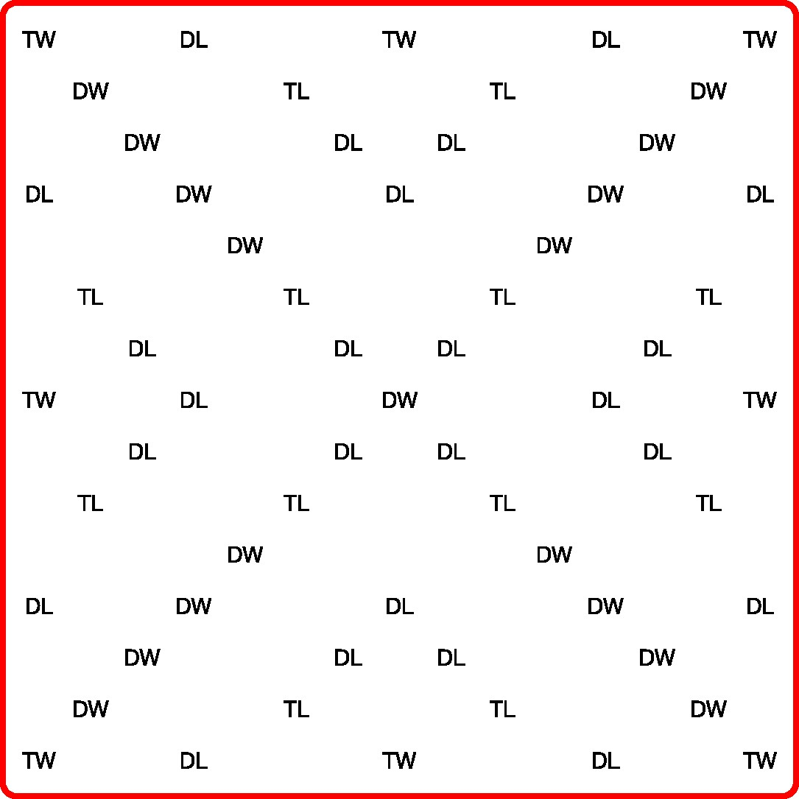
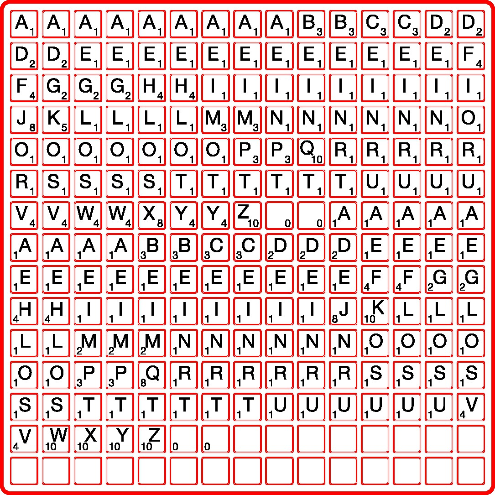

# scrabble-board-generator
Scripts to generate files to make laser-cut Scrabble boards

## What is this

I wanted to build a game of Scrabble from laser cut pieces of wood. To laser cut the board, letters etc, I needed to generate SVG files with the shapes to laser cut and laser etch. Instead of designing the files by hand, I wanted to write a python script that does it.
So this repo contains a script to programmatically generate SVG files to build a Scrabble board.
Most aspects of the board are configurable, it even supports multiple languages (for now, English and French, the letter tiles are differentiated by the placement of the score).

## Usage
- Install the packages in `requirements.txt`
- Edit the parameters if you want different values, other languages etc
- Run the script
- 2 SVG files will be generated in the `outputs` folder

## Results

With the current parameters, the base of the board will look like:

And the file combining the tiles and the grid will look like:

To build the final board, I painted two sheets of 3mm wood with wood stained, used the SVGs to laser cut the patterns, glued everything together and here's the result:

Overall I'm verty happy with the result. It looks quite pretty, the contrast between the wood color and the laser etched text is decent, and overall it looks sturdy despite being only 6mm thick.

In terms of improvements, it could be nice to:
- use wood stains of different colors for the base and tiles
- paint the text (white for dark wood, black for light wood) in order to increase the contrast
- incorporate a system to keep track of the score on the board